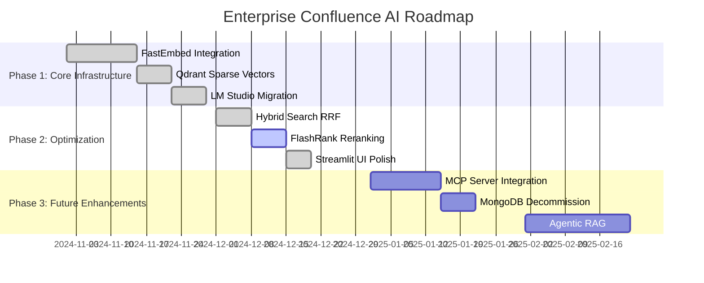
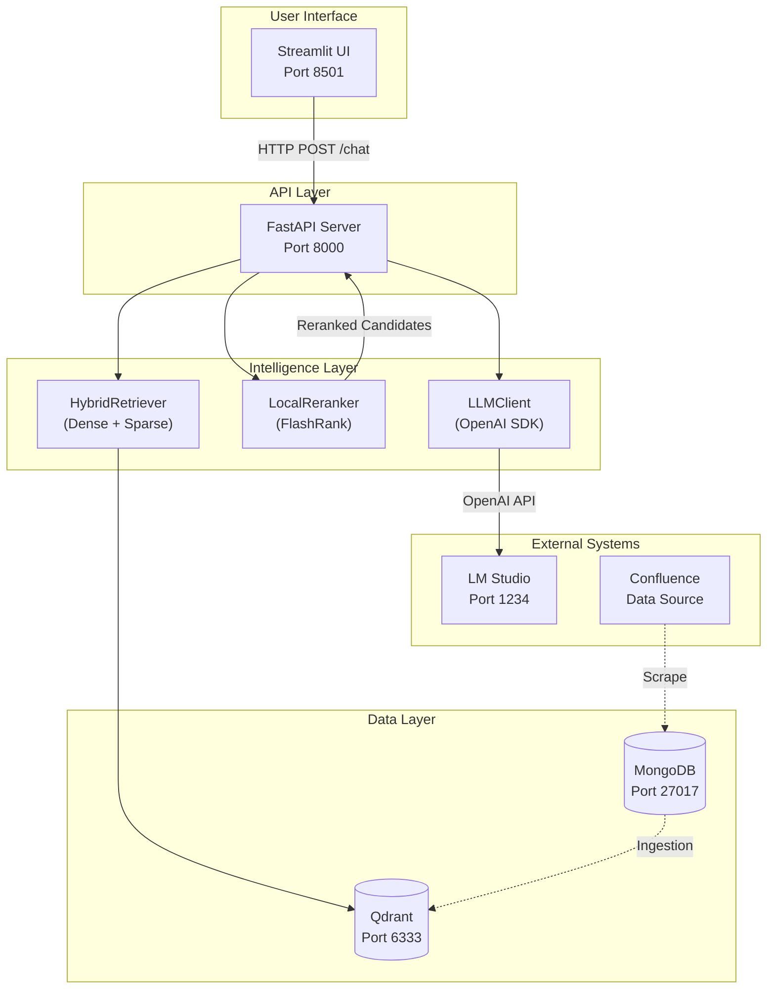
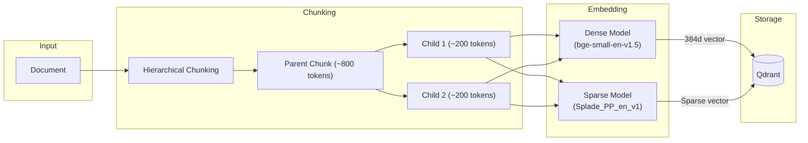
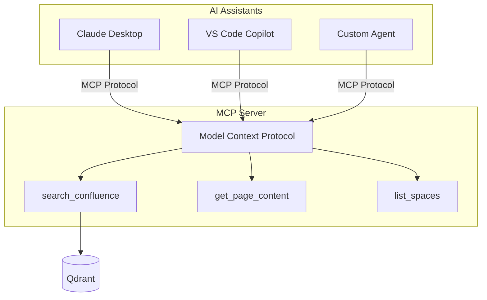

# Enterprise Confluence AI
**Intelligent Question-Answering for Confluence Documentation**

---

## 1. Executive Summary
The **Enterprise Confluence AI** is a **Retrieval-Augmented Generation (RAG)** system designed for intelligent, context-aware question-answering over Confluence documentation. It integrates **hybrid search (dense + sparse retrieval)**, **local LLM inference**, and **enterprise-grade scalability**.

### Key Features
- **Hybrid Search**: Combines semantic (dense) and keyword (sparse) retrieval with **Reciprocal Rank Fusion (RRF)**.
- **Offline-First**: All models and components run locally, ensuring data privacy and zero internet dependency.
- **Enterprise-Ready**: Optimized for **30,000+ document chunks** with efficient indexing and retrieval.
- **LM Studio Integration**: Supports any **OpenAI-compatible local LLM** for flexible inference.

---

## 2. Roadmap

### Gantt Chart: Development Timeline



## 3. High-Level Design (HLD)

### 3.1 System Architecture


### 3.2 Component Overview

| Component          | Technology       | Purpose                          |
|--------------------|------------------|----------------------------------|
| User Interface     | Streamlit        | Web-based Q&A interface          |
| API Server         | FastAPI          | REST endpoints, streaming        |
| Embeddings         | FastEmbed (ONNX) | Dense + Sparse vector generation |
| Vector Store       | Qdrant           | Hybrid search, RRF fusion        |
| LLM                | LM Studio        | Local AI inference               |
| Reranker           | FlashRank        | Cross-encoder relevance scoring  |

### 3.3 Data Flow
1. **Ingestion Pipeline**:
   `Confluence → MongoDB → Chunking → FastEmbed → Qdrant`
2. **Query Pipeline**:
   `User → API → Hybrid Search → Rerank → LLM → Response`

---

## 4. Low-Level Design (LLD)

### 4.1 Module Structure
```
enterprise_confluence_ai/
├── chat/
│   ├── chat_api.py          # FastAPI endpoints
│   └── prompt_template.py   # System prompts
├── ingestion/
│   ├── embedder.py          # FastEmbed pipeline
│   ├── text_cleaner.py      # Hierarchical chunking
│   └── extract.py           # Confluence scraper
├── config/
│   └── settings.py          # Pydantic settings
├── utils/
│   └── llm_client.py        # OpenAI SDK wrapper
├── retrieval.py             # HybridRetriever + LocalReranker
├── streamlit_app.py         # UI application
└── models_cache/            # Local ONNX models
    ├── bge-small-en-v1.5/   # Dense model (384d)
    └── Splade_PP_en_v1/     # Sparse model
```

### 4.2 Key Classes

#### HybridRetriever
```python
class HybridRetriever:
    """Combines Dense + Sparse search with RRF fusion."""

    def __init__(self, qdrant_client, collection_name):
        self.dense_model = TextEmbedding("BAAI/bge-small-en-v1.5")
        self.sparse_model = SparseTextEmbedding("prithivida/Splade_PP_en_v1")

    def search(self, query: str, limit: int = 10) -> List[Dict]:
        # 1. Generate dense (384d) and sparse embeddings
        # 2. Prefetch from Qdrant
        # 3. Fuse results with RRF
        # 4. Return ranked candidates
```

#### LocalReranker
```python
class LocalReranker:
    """Cross-encoder reranking using FlashRank."""

    def __init__(self, model_name="ms-marco-TinyBERT-L-2-v2"):
        self.ranker = Ranker(model_name=model_name)

    def rerank(self, query: str, candidates: List, top_n: int = 5) -> List:
        # Score candidates against query
        # Return top-N by relevance
```

#### LLMClient
```python
class LLMClient:
    """Async wrapper for OpenAI-compatible APIs."""

    def __init__(self, base_url: str):
        self.client = AsyncOpenAI(base_url=base_url)

    async def generate_stream(self, prompt: str) -> AsyncGenerator[str]:
        # Stream tokens from LM Studio
```

### 4.3 Embedding Pipeline


### 4.4 Query Processing Flow

```mermaid
sequenceDiagram
    participant U as User
    participant UI as Streamlit
    participant API as FastAPI
    participant RET as HybridRetriever
    participant QD as Qdrant
    participant RRK as LocalReranker
    participant LLM as LM Studio

    U->>UI: What is SIC RTGS?
    UI->>API: POST /chat

    rect rgb(50, 50, 80)
        Note over API,QD: Retrieval Phase
        API->>RET: search(query)
        RET->>QD: Dense prefetch (limit=20)
        RET->>QD: Sparse prefetch (limit=20)
        QD-->>RET: RRF fused results
        RET-->>API: Top 20 candidates
    end

    rect rgb(80, 50, 50)
        Note over API,RRK: Reranking Phase
        API->>RRK: rerank(query, candidates)
        RRK-->>API: Top 5 reranked
    end

    rect rgb(50, 80, 50)
        Note over API,LLM: Generation Phase
        API->>LLM: chat/completions (streaming)
        loop Token Stream
            LLM-->>API: token
            API-->>UI: NDJSON token
        end
    end

    UI-->>U: Display answer + sources
```


---

## 5. Configuration

### 5.1 Environment Variables

| Variable               | Description                     | Default                          |
|------------------------|---------------------------------|----------------------------------|
| `LLM_BASE_URL`         | LM Studio endpoint              | `http://localhost:1234/v1`       |
| `LLM_MODEL`            | Model identifier                | `openai/gpt-oss-20b`             |
| `QDRANT_URL`           | Vector database                 | `http://localhost:6333`          |
| `QDRANT_COLLECTION`    | Collection name                 | `confluence_vectors_fastembed`   |
| `FASTEMBED_CACHE_PATH` | Local model path                | `./models_cache`                 |
| `TOP_K`                | Results to return               | `5`                              |

### 5.2 Model Requirements

| Model                     | Size    | Memory  | Download       |
|---------------------------|---------|---------|----------------|
| bge-small-en-v1.5          | ~100 MB | ~200 MB | HuggingFace    |
| Splade_PP_en_v1            | ~500 MB | ~600 MB | HuggingFace    |
| ms-marco-TinyBERT-L-2-v2   | ~50 MB  | ~100 MB | HuggingFace    |

---

## 6. Deployment

### 6.1 Local Development (venv)
```powershell
# 1. Start infrastructure
docker-compose up -d mongo qdrant

# 2. Start LM Studio on port 1234

# 3. Activate venv
.\.venv\Scripts\Activate

# 4. Run ingestion (one-time)
python -m ingestion.embedder

# 5. Start API
uvicorn chat.chat_api:app --port 8000 --reload

# 6. Start UI
streamlit run streamlit_app.py --server.port 8501
```

### 6.2 Docker Deployment
```powershell
# Full stack
docker-compose up -d
```

---

## 7. Performance Metrics

| Metric                     | Value         | Notes                          |
|----------------------------|---------------|--------------------------------|
| Ingestion Speed            | ~1000 chunks/min | With Dense+Sparse              |
| Query Latency (Retrieval)  | ~50ms         | Qdrant hybrid search           |
| Query Latency (Reranking)  | ~100ms        | FlashRank TinyBERT             |
| Query Latency (LLM)        | 30-120s       | Depends on model/GPU           |
| Memory (API)               | ~1 GB         | Includes embedding models      |

---

## 8. Future Architecture

### 8.1 MCP Server Integration (Planned)


### 8.2 Agentic RAG (Planned)
- Multi-step reasoning with tool calling
- Self-reflection and query refinement
- Citation verification
- Confidence scoring

---

## Appendix A: Troubleshooting

| Issue                     | Cause                          | Solution                          |
|---------------------------|--------------------------------|-----------------------------------|
| SSLError                  | Firewall blocking HuggingFace  | Download models manually          |
| model_max_length overflow | Tokenizer config issue          | Set to 512 in tokenizer_config.json |
| vector name not found     | Collection schema mismatch      | Delete collection, re-run ingestion |
| No response in UI         | NDJSON vs SSE format           | Fixed in streamlit_app.py         |
